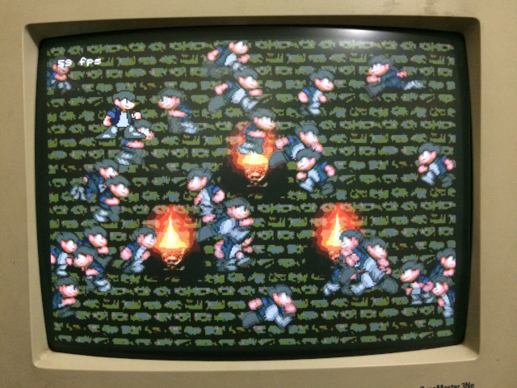
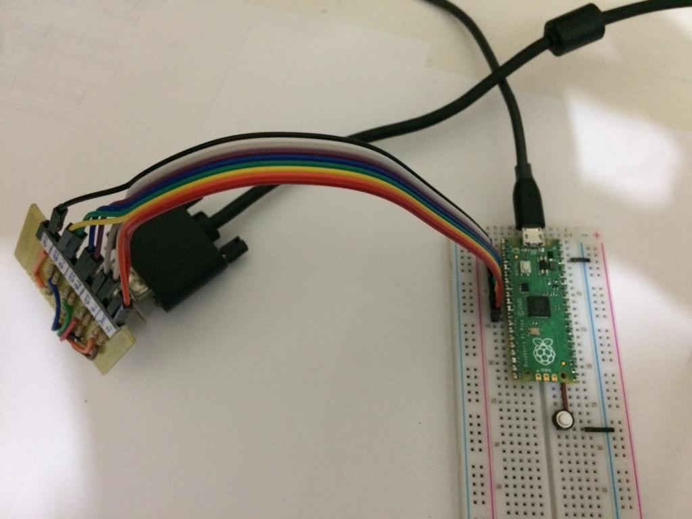
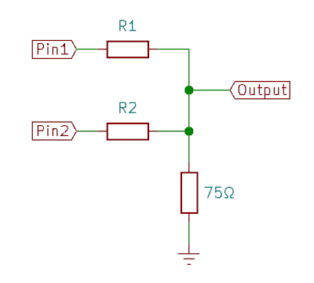

# pico-vga-6bit-demo

This is a simple demo of VGA output with the Raspberry Pi Pico:

The [official
repositories](https://github.com/raspberrypi/pico-playground) include
demos with better VGA output, so you might look there first. I wrote
this code because those examples don't work with my old CRT monitor
(the monitor displays a very garbled screen and makes a scary noise
when I try). The documentation mentions they use a "slightly
non-standard 24Mhz system clock", which is almost 5% off the standard
25.175MHz, so maybe that's the reason.

This demo uses the a pixel clock of 25 MHz, which is much closer to
the standard.  The resolution is 320x240 with just 6 bits for color
information, which gives 64 colors in total. It has two framebuffers
of 320x240 pixels, and anyone drawing to the frambuffer is responsible
for correctly updating the 2 top bits which contain the sync signals
(for vertical and horizontal sync).  Messing up those bits *will*
result in the monitor losing synchronization, and can possibly damage
the monitor (although I imagine modern LCD screens will just stop
displaying the image and ignore the bad signal). The text drawing code
(`vga_font.c`) takes care of that automatically, but the sprite
drawing code (`vga_draw.c`) does not, and expects the sync bits to be
baked in the image data to achieve better speed.

The basic design of the VGA signal generation code is based on
bitluni's [ESP32Lib](https://github.com/bitluni/ESP32Lib), which
generates VGA output with the ESP32 using the I2S peripheral.  This
code is completely independent and uses the Pico's PIO to handle the
output, but the organization of the DMA transfers draws heavily from
VGALib's design.

To hook the monitor to the Pico, a resistor ladder or some other form
of DAC is required for each color component (red, green and blue) to
convert the digital output from the Pico to the analog color signal.
The V-Sync and H-Sync output pins require a resistor (220ohms should
be OK) in series.

The schematic I'm using (shown in the picture above) for each color is
this, with resistors R1=560Ω on the most significant bit pin and
R2=1KΩ on the least significant bit pin.

The output pins used in the Pico (configured in `main.c`) are:

- pins 2, 3: red (pin 2 is the least significant bit)
- pins 4, 5: green (pin 4 is the least significant bit)
- pins 6, 7: blue (pin 6 is the least significant bit)
- pin 8: horizontal sync
- pin 9: vertical sync

Don't forget to connect the Pico's ground to the VGA cable ground.
